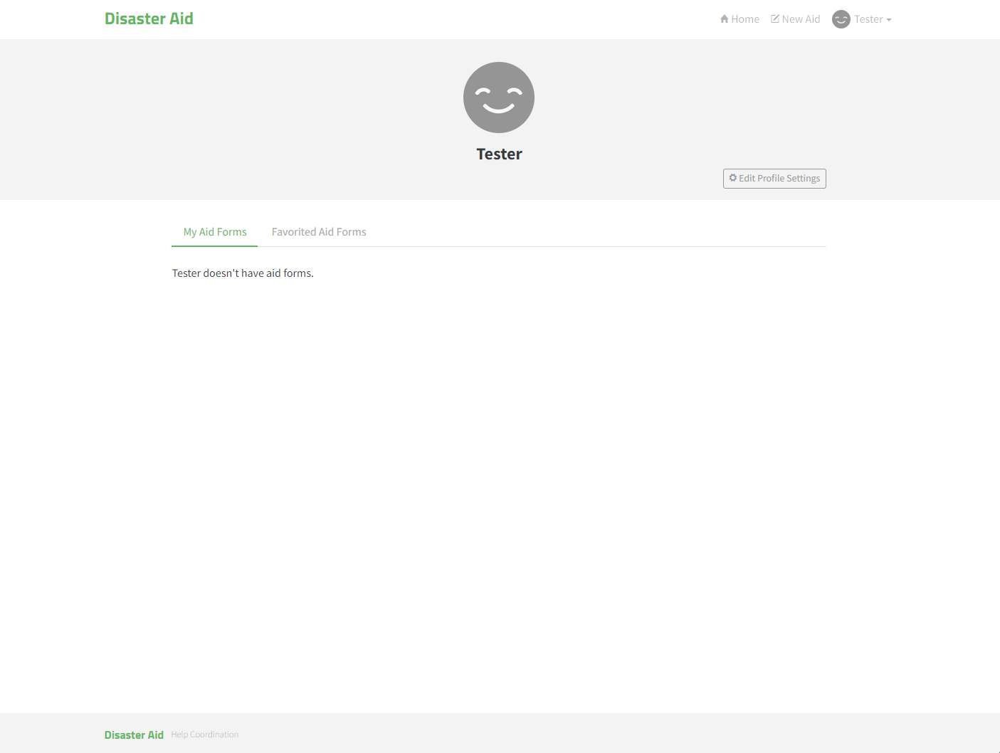

> # Disaster Aid Web Application
Welcome to the Disaster Aid web application! This application aims to provide assistance and support during times of disaster and emergency situations. Whether it's a natural calamity, humanitarian crisis, or any other type of emergency, Disaster Aid is here to help.
## Introduction
Disaster Aid is a user-friendly web application designed to connect individuals affected by disasters with essential resources, volunteers, and support services. The application serves as a platform for disaster response and assistance, facilitating communication, coordination, and collaboration among various stakeholders involved in relief efforts.
## Website
The website is available at [https://disaster-aid.onrender.com/](https://disaster-aid.onrender.com/). Sometimes it can take a few seconds to load the website because it is hosted on a free server. Please be patient.
## GUI
### Home

### Login

### Signup

### Profile

### Aid Form

### Aid Page

### User Feeds

## Technical Overview
Disaster Aid is a fully fledged fullstack application built with **React / Express.js / Sequelize / PostgreSQL** including CRUD operations, authentication, routing, pagination, and more.
### Prerequisites
- Make sure your have a Node.js (v16 or newer) installed.
- Make sure you have your database setup.
### Installation
Install all the npm dependencies with the following command:
```bash
npm install
```
### Configuration
In the [`backend`](backend/) directory, duplicate and remane the`.env.example` file, name it `.env`, and modify it to set all the required private development environment variables.
Optionally you can run the following command to populate your database with some dummy data
```bash
npx -w backend sequelize-cli db:seed:all
```
### Starting the development server
Start the development environment with the following command:
```bash
npm run dev
```
- The frontend website should be available at [http://localhost:3000/](http://localhost:3000).

- The backend API should be available at [http://localhost:3001/api](http://localhost:3001/api).
### Production
The following command will build the production version of the app:
```bash
npm start
```